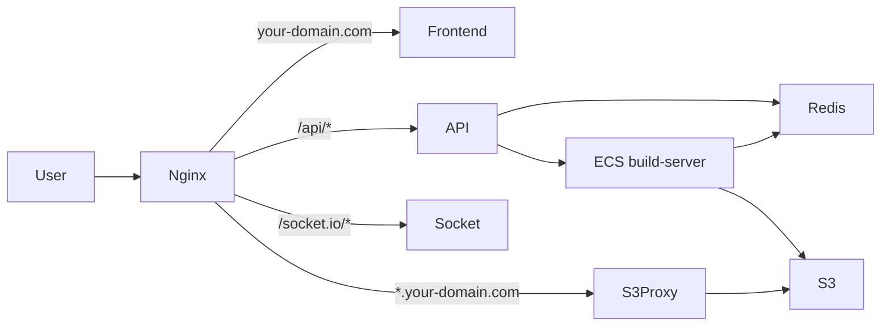

# EC2 Deployment Guide

Deploy **3 Node services + local Redis** on a single EC2 instance:

| Service | Role | Internal port |
|---------|------|---------------|
| `frontend-nextjs` | Deploy UI | 3000 |
| `api-server` | REST API + Socket.IO logs | 9000 / 9002 |
| `s3-reverse-proxy` | Serves deployed sites from S3 | 8000 |
| `redis-server` | Pub/sub for build logs (local) | 6379 |

Nginx on port 80 routes traffic to the right service.

## Architecture



## 1. Launch EC2

- **AMI:** Ubuntu 22.04 or 24.04
- **Instance type:** t3.small or larger
- **Security group inbound:**
  - 22 (SSH)
  - 80 (HTTP)
  - 443 (HTTPS, optional)
  - 6379 — only if ECS build tasks need Redis (restrict to VPC CIDR)

## 2. DNS

### Option A — You have a domain

Point these to your EC2 public IP:

- `your-domain.com` → EC2
- `*.your-domain.com` → EC2 (wildcard for deployed previews)

### Option B — No domain (use nip.io, free, no signup)

Deployed previews use **subdomains** (`my-project.yourhost`). A bare IP like `54.1.2.3` cannot do `my-project.54.1.2.3` in a browser.

Use **[nip.io](https://nip.io)** — it turns your IP into a hostname that supports wildcards automatically:

| EC2 public IP | Use as DOMAIN |
|---------------|---------------|
| `54.123.45.67` | `54.123.45.67.nip.io` |

- App UI: `http://54.123.45.67.nip.io`
- Deploy preview: `http://my-project.54.123.45.67.nip.io`

No DNS setup. Just put your IP in `.env` (see below).

**Alternative:** [sslip.io](https://sslip.io) works the same way (`54-123-45-67.sslip.io`).

### Option C — IP + open ports only (previews won't work)

Open ports 3000, 8000, 9000, 9002 in the security group and skip nginx. Good for testing the deploy UI only — preview URLs will not work without subdomains.

## 3. Clone and configure

Clone the repo anywhere on the server (home directory is fine):

```bash
git clone <your-repo-url> vercel-clone
cd vercel-clone

cp deploy/.env.example .env
nano .env   # fill in AWS keys, ECS ARNs, DOMAIN, etc.
```

The setup script resolves paths from wherever you cloned the repo — no `/opt` folder required.
Key variables (with domain):

```bash
DOMAIN=your-domain.com
DEPLOY_HOST=your-domain.com
NEXT_PUBLIC_API_URL=http://your-domain.com/api
NEXT_PUBLIC_SOCKET_URL=http://your-domain.com
REDIS_URL=redis://127.0.0.1:6379
```

**No domain?** Replace with your EC2 IP + nip.io (example IP `54.123.45.67`):

```bash
DOMAIN=54.123.45.67.nip.io
DEPLOY_HOST=54.123.45.67.nip.io
NEXT_PUBLIC_API_URL=http://54.123.45.67.nip.io/api
NEXT_PUBLIC_SOCKET_URL=http://54.123.45.67.nip.io
FRONTEND_ORIGIN=http://54.123.45.67.nip.io
REDIS_URL=redis://127.0.0.1:6379
```

## 4. Run setup script

```bash
sudo bash deploy/ec2-setup.sh
```

This installs system packages as root, but runs **npm build and PM2 as ubuntu** (not root).

> **Important:** After setup, use `bash deploy/restart.sh` as **ubuntu** — never `sudo bash deploy/restart.sh`.

## 5. Verify

```bash
pm2 status
pm2 logs
redis-cli ping          # should return PONG
curl http://localhost:9000   # API (direct)
curl http://localhost:3000   # Frontend (direct)
```

Open `http://your-domain.com` in a browser.

## Redis (local)

Redis runs on the same EC2 box. The API server connects via `redis://127.0.0.1:6379`.

If you still use **ECS Fargate** for `build-server`, Fargate tasks must reach this Redis:

1. Set `REDIS_URL_FOR_ECS=redis://<EC2_PRIVATE_IP>:6379` in `.env`
2. In `/etc/redis/redis.conf`, change `bind 127.0.0.1` to `bind 0.0.0.0`
3. Restart Redis: `sudo systemctl restart redis-server`
4. Allow port 6379 from your VPC only in the EC2 security group

## Restart services

After code changes or `.env` updates:

```bash
# Run as ubuntu — NOT sudo
bash deploy/restart.sh --rebuild
bash deploy/restart.sh --nginx   # only this step uses sudo internally
```

If you see `EACCES permission denied` on `.next/trace`, a previous `sudo` run left root-owned files:

```bash
bash deploy/fix-permissions.sh
bash deploy/restart.sh --rebuild
```

## Manual commands

```bash
# Quick restart (same as deploy/restart.sh)
bash deploy/restart.sh

# View logs
pm2 logs api-server
pm2 logs s3-reverse-proxy
pm2 logs frontend
```

## Local development

Create a `.env` in the project root (same format as `deploy/.env.example`):

```bash
REDIS_URL=redis://127.0.0.1:6379
```

Run Redis locally, then in separate terminals:

```bash
cd api-server && node index.js
cd s3-reverse-proxy && node index.js
cd frontend-nextjs && npm run dev
```
